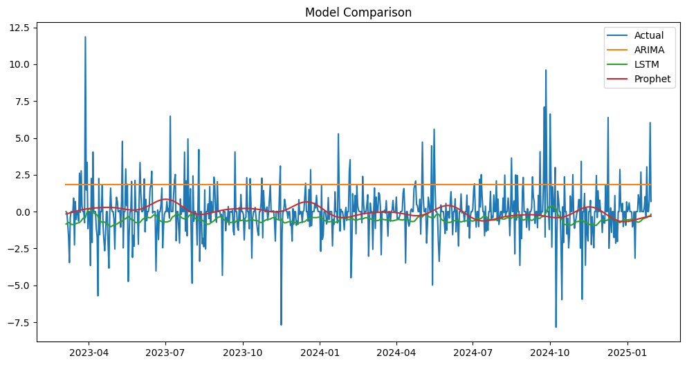
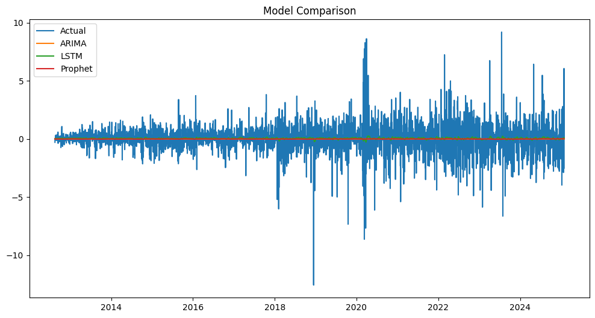
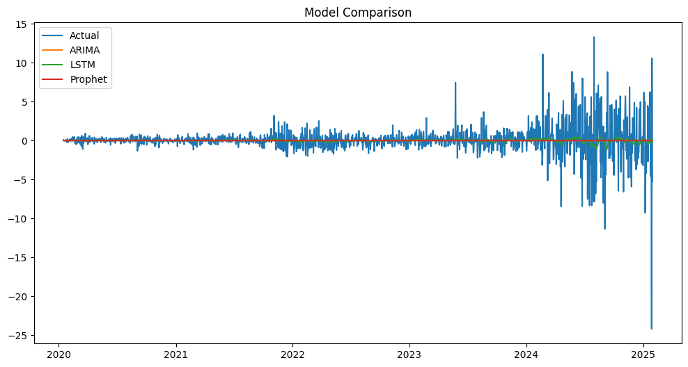
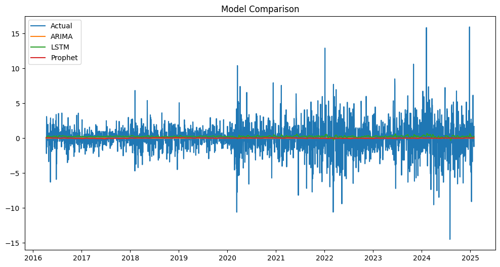

# Stock Price Forecasting using ARIMA, LSTM, and Prophet Models

This repository contains the code and resources for a study on forecasting the stock prices of Alibaba (BABA), Johnson & Johnson (JNJ), NVIDIA (NVDA), and Toyota Motor Corporation (TM) using ARIMA, LSTM, and Prophet models.  The goal is to provide long-term investors with informed insights to aid in making calculated investment decisions.

## 1. Introduction

The stock market is a complex and dynamic system influenced by numerous factors. This project leverages data science techniques to analyze and forecast the prices of four prominent stocks:

*   BABA (Alibaba Group)
*   NVDA (NVIDIA Corporation)
*   JNJ (Johnson & Johnson)
*   TM (Toyota Motor Corporation)

The project encompasses data collection and cleaning, exploratory data analysis (EDA), LSTM-based predictive modeling, and the development of an interactive dashboard (planned or implemented - specify). The dashboard allows users to explore historical data, visualize trends, and make informed decisions based on model predictions.

## 2. Data Collection

Stock data was collected at three different time intervals to capture market dynamics at various scales:

*   **Short Range:** 1 month, 2-minute intervals (High-frequency data for short-term fluctuations).
*   **Medium Range:** 2 years, 1-hour intervals (Identifying medium-term trends).
*   **Long Range:** Maximum available historical data, 1-day intervals (Analyzing long-term trends).

The selected stocks represent diverse industries (e-commerce, technology, healthcare, and automotive) for a broad market analysis.

## 3. Methodology

This study compares the performance of three forecasting models:

*   **ARIMA:** A traditional statistical time-series model.
*   **LSTM (Long Short-Term Memory):** A type of recurrent neural network (RNN) well-suited for sequential data like stock prices.
*   **Prophet:** A forecasting model developed by Facebook, designed for time-series data with seasonality and trend.

The models were trained and evaluated using the collected stock data.  The predictive accuracy of each model was compared to determine the most effective approach for each stock.

## 4. Results (Summary)

The results indicate that LSTM and Prophet models significantly outperform the ARIMA model in predicting stock prices for all four companies. This highlights the effectiveness of deep learning and specialized time-series models for capturing the complex patterns in stock market data.

**Model Performance Comparison**

<table>
  <tr>
    <td align="center">
      <strong>Alibaba (BABA)</strong> 
      
    </td>
    <td align="center">
      <strong>Johnson & Johnson (JNJ)</strong> 
      
    </td>
  </tr>
  <tr>
    <td align="center">
      <strong>NVIDIA (NVDA)</strong> 
      
    </td>
    <td align="center">
      <strong>Toyota Motor Corporation (TM)</strong> 
      
    </td>
  </tr>
</table>

## 5. Repository Contents

* `.github/workflows/`: Contains workflow files for GitHub Actions.
* `.vscode/`: Contains VS Code specific settings and configurations.
* `Data/`: Contains the collected stock data (or scripts to collect the data). 
* `images/`: Contains image files used in the README and potentially elsewhere.
* `notebooks/`: Contains Jupyter notebooks used for data analysis, model development, or exploration.
* `scripts/`: Contains helper scripts for data processing or visualization.
* `src/`: Contains the main source code for your project, potentially organized into modules.
* `tests/`: Contains files for testing your code.
* `.gitattributes`: Specifies attributes for files in your Git repository.
* `.gitignore`: Specifies intentionally untracked files that Git should ignore.
* `README.md`: This file.
* `requirements.txt`: List of required Python packages. (Important!)